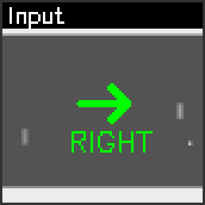

# 🌌 LeJEPA-MVP: The Road to World Models
> **"Don't just memorize the universe; understand its laws."**
>
> **不只是记忆宇宙，而是推演它的法则。**

[](https://opensource.org/licenses/MIT)
[](https://arxiv.org/abs/2511.08544)
[]()

**LeJEPA-MVP** 是 Yann LeCun 提出的 **[LeJEPA (Latent-Euclidean Joint-Embedding Predictive Architecture)](https://arxiv.org/abs/2511.08544)** 架构的**极简工业级复现与验证项目**。

本项目旨在向社区证明：**世界模型（World Model）并非大厂专利。**
仅凭消费级显卡（RTX 3060 12G），我们不仅能训练出 SOTA 级的图像分类器，更能训练出一个**懂得物理因果律的预测大脑**。

---

## 🚀 双轨验证 (Dual-Track Validation)

本项目包含两个独立的 MVP 应用，分别验证了 LeJEPA 的两项核心能力：

### 🎨 Track A: 高级识别器 (Galaxy Recognizer)
*   **目标**: 验证 **SIGReg (高斯正则化)** 在小样本下的特征提取能力。
*   **数据**: Galaxy10 DECals (2.2万张星系图)。
*   **架构**: `ViT-Small Encoder` + `SIGReg Loss`。
*   **战绩**:
    *   **Data Efficiency**: 仅用 DINOv2 0.01% 的数据量。
    *   **Accuracy**: Fine-tuning 达到 **81.71%** (超越 ResNet-50 监督学习基准)。
    *   **Visualization**: 无监督聚类呈现出完美的形态学拓扑结构。

### 🧠 Track B: 预测型世界模型 (Atari World Model)
*   **目标**: 验证 **Predictive Architecture** 的物理推演能力 (`Pred(Enc(x), a) ≈ Enc(y)`).
*   **数据**: Synthetic Atari Pong (5万帧随机操作录像，本地生成)。
*   **架构**: `ResNet18 Encoder` + `MLP Predictor` + `SIGReg Loss`。
*   **战绩**:
    *   **Physics Understanding**: 在“真假未来”指认测试中达到 **96.0%** 准确率。
    *   **Causality**: 模型能够根据动作（如“向上”），在潜空间精准推算出球的运动轨迹。

---

## 🎬 核心展示 (Showcase)

### 1. 读心术：AI 如何预测未来？ (Atari World Model)
这不是生成的像素动画，这是 AI 大脑内部的**推演过程可视化**。
*   **左图**: 当前状态 + 动作指令（绿色箭头）。
*   **右图**: AI 从 10 张候选图中，**一眼认出**了符合物理规律的真实未来（红圈为球的位置）。


> **解读**: AI 并没有“画”出球，但它计算出的向量与真实未来的向量高度重合。它知道：“在这个位置，如果挡板往上移，球应该出现在那里。”

### 2. 星辰大海：AI 眼中的宇宙 (Galaxy Recognizer)
这是模型在**全量训练 (Full Training)** 后，对星系形态的深刻理解。
注意看每一行的**语义一致性**：即使背景噪点不同，模型依然能精准检索出同类型的星系。


> **解读**: 
> *   **第一行 (Spiral)**: 检索出的全是完美的旋涡星系，Sim 分数高达 0.95+。
> *   **第二行 (Smooth)**: 圆滑的椭圆星系，没有混入任何杂质。
> *   **第三行 (Edge-on)**: 侧向观测的“飞碟状”星系，特征捕捉极其敏锐。
> *   **结论**: SIGReg 成功构建了一个**各向同性且语义纯净**的高维流形。

---

## 🛠️ 快速复现 (Quick Start)

我们提供了一键式 CLI 入口，支持 Windows/Linux/WSL。

### 1. 环境准备
```bash
git clone https://github.com/your-username/lejepa-mvp.git
cd lejepa-mvp
pip install -r requirements.txt
```

### 2. 运行 Atari 世界模型 (Track B)
体验从零训练一个物理大脑（耗时约 30 分钟）。

```bash
# 1. 生成数据 (无需下载，本地仿真)
python tools/generate_atari_data.py

# 2. 开始训练 (ResNet18 + SIGReg)
python run.py atari --mode train

# 3. 验证物理规律 (量化审计)
python run.py atari --mode verify
# 预期输出: Retrieval Accuracy > 90%

# 4. 生成演示动图 (可视化)
python run.py atari --mode demo
# 结果保存在 runs/atari_mvp/demos/
```

### 3. 运行 Galaxy 识别器 (Track A)
体验小样本 SOTA 训练。

```bash
# 1. 准备数据
# 请下载 Galaxy10_DECals.h5 放入 data/ 目录

# 2. 训练
python run.py galaxy --mode train

# 3. 评估与可视化
python run.py galaxy --mode vis
```

---

## 🧠 工程哲学 (Engineering Philosophy)

本项目严格遵循 **Aegis 架构准则**：

1.  **去魔法化 (No Magic)**: 移除了 Teacher Network、Stop-Gradient、EMA 等脆弱组件。回归纯粹的数学约束。
2.  **硬件友好 (Consumer Friendly)**: 通过 **梯度累积 (Gradient Accumulation)** 技术，在 12G 显存上模拟 256 Batch Size 的训练效果。
3.  **数值审计 (Quantitative Audit)**: 拒绝主观的“看图说话”，使用 Top-1 Retrieval Accuracy 等硬指标验证模型能力。

---

## 📂 项目结构 (Structure)

```text
📂 lejepa-mvp/
├── 📂 src/
│   ├── 📂 apps/
│   │   ├── 📂 atari_world_model/  # [Track B] 预测架构核心
│   │   └── 📂 galaxy_recognizer/  # [Track A] 识别架构核心
│   └── 📂 shared/                 # LeJEPA 通用组件 (Encoder, Loss)
├── 📂 tools/                      # 数据生成与清理工具
├── 📂 configs/                    # 单点真理配置
└── run.py                         # 统一 CLI 入口
```

---

## 🤝 贡献与致谢

*   **理论基础**: [Yann LeCun - LeJEPA Paper](https://arxiv.org/abs/2511.08544)
*   **数据集**: Galaxy10 DECals & Gymnasium Atari
*   **架构设计**: Aegis Architect System

> *"The revolution will not be supervised."* —— Yann LeCun
